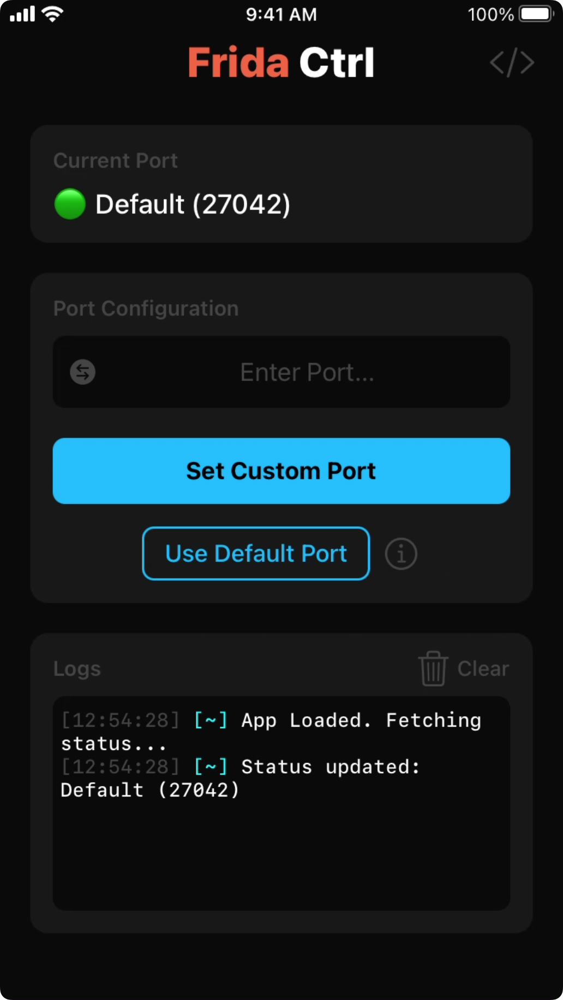

# FridaCtrl

<div align="center">
  
</div>

A simple utility for jailbroken iOS devices to manage the network port used by `frida-server`.

## Features

* Allows setting a custom listening port (e.g., `12345`).

## Description

[Frida](https://frida.re/) is a powerful dynamic instrumentation toolkit widely used in mobile security research and development. By default, its server component (`frida-server`) on iOS listens for connections on TCP port 27042.

FridaCtrl offers a convenient graphical user interface to modify the `frida-server` configuration (its LaunchDaemon `.plist` file) and reload the service, applying the port change without requiring manual SSH sessions, text editing, and `launchctl` commands.

## Manual Port Change (via SSH)

If you prefer to change the port manually without using this app, you can do so via SSH:

1.  **SSH** into your device as the `root` user.
2.  **Identify Plist Path:** Determine the correct path for the `frida-server` LaunchDaemon plist:
    * **Rootless:** `/var/jb/Library/LaunchDaemons/re.frida.server.plist`
    * **Rootful (Legacy):** `/Library/LaunchDaemons/re.frida.server.plist`
    Let's refer to the correct path as `<PLIST_PATH>`.
3.  **Edit Plist:** Use a command-line text editor like `nano`:
    ```bash
    nano <PLIST_PATH>
    ```
4.  **Modify Arguments:** Navigate to the `<key>ProgramArguments</key>` section. This contains an `<array>` of `<string>` elements.
    * **To Set Custom Port (e.g., 12345):**
        1.  Add these two lines inside the `<array>` (typically after the `frida-server` path string):
            ```xml
            <string>-l</string>
            <string>0.0.0.0:12345</string>
            ```
            *(Replace `12345` with your desired port. `0.0.0.0` allows connections from other devices on the network.)*
    * **To Revert to Default Port:**
        1.  Find and remove the `<string>-l</string>` line.
        2.  Find and remove the `<string>...</string>` line immediately following it (the one with the custom port/address).
5.  **Save Changes:** In `nano`, press `Ctrl+X`, then `Y` to confirm saving, then `Enter`.
6.  **Reload Service:** Apply the changes using `launchctl`:
    ```bash
    launchctl unload <PLIST_PATH>
    # The unload command might not produce anything if the service wasn't running.
    launchctl load <PLIST_PATH>
    # This command should also not print anything on success.
    ```
    The `frida-server` should now be running (or restarted) with the updated configuration.

## Developer

Developed by Vinay Kumar Rasala ([Xplo8E](https://github.com/Xplo8E)) with ❤️
